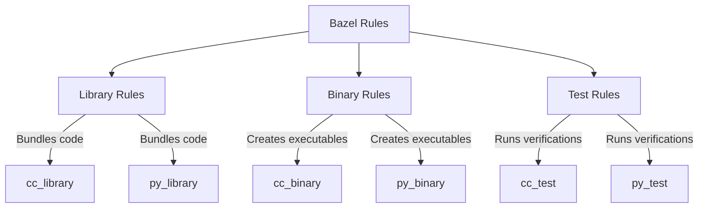
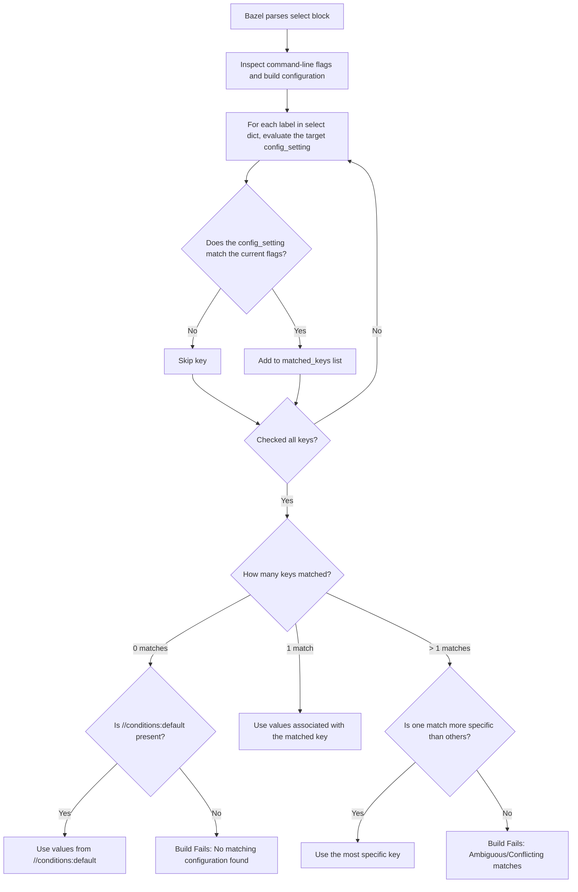

# BUILD Masterclass: The Blueprints of Your Codebase

Welcome! In this lecture, we are going to dive deep into **BUILD files** (or `BUILD.bazel` files). Together with `WORKSPACE` (and `MODULE.bazel`), these files form the core configuration layer of any Bazel project. We will unpack every concept using the **Feynman Technique**: simple analogies, plain language, and direct examples based on the workspace we've been using.

---

## 🗺️ The Analogy: Building a Modern City

If we compare a Bazel project to building a modern city:
*   **`WORKSPACE` / `MODULE.bazel`** is the **customs office at the border**. It imports raw goods and external resources (e.g., concrete from Google, piping from Python libraries) and names them.
*   **`BUILD` files** are the **local construction blueprints** for each block or neighborhood. They define:
    1.  What **buildings** (targets: libraries, binaries, tests) will stand on this block.
    2.  What **materials** (sources: `.cc`, `.py`, `.h` files) are needed to construct them.
    3.  Which **other buildings** they rely on (dependencies: power cables, pipes from the core substation).
    4.  Who is **allowed inside** (visibility: public access vs. restricted security clearance).

Without `BUILD` files, Bazel sees your codebase as just a pile of text files, unaware of how they link together to form a functioning application.

---

## 📦 Phase 1: Packages and Labels (The Address System)

Before building, we need an address system. In Bazel, this is built around **Packages** and **Labels**.

### What is a Package?
In Bazel, a **package** is defined simply as any directory in your project that contains a file named `BUILD` or `BUILD.bazel`. 

```
bazel_master/
├── core/
│   ├── BUILD.bazel      <-- Defines the '//core' package
│   ├── memory.cc
│   └── memory.h
└── utils/
    ├── BUILD.bazel      <-- Defines the '//utils' package
    └── string_utils.cc
```

If a directory does not have a `BUILD` file, it is NOT a package. It is just a subfolder belonging to the nearest parent directory that *does* have a `BUILD` file.

> [!TIP]
> **Use `BUILD.bazel` instead of `BUILD`:** While both filenames are supported, `BUILD.bazel` is highly recommended. It avoids conflicts with generic folders named `build` on case-insensitive filesystems.

### Understanding Labels (Target Addresses)
Every target in your project has a unique address called a **Label**. A label tells Bazel exactly where to find a build target:

```
@bazel_query_tutorial//core:memory
```

Let's break this label into its constituent parts:

| Component | Example | Meaning |
| :--- | :--- | :--- |
| **Workspace Name** | `@bazel_query_tutorial` | Identifies which workspace/island the target lives in. If you omit this (e.g., `//core:memory`), Bazel assumes the current workspace. |
| **Package Path** | `//core` | The directory path relative to the workspace root. The double slash `//` represents the workspace root directory. |
| **Target Name** | `:memory` | The specific target defined inside that package's `BUILD` file. |

### Label Shortcuts
When writing BUILD files, you don't always have to write the full canonical path. You can use shortcuts:

*   **Relative Target:** If you are inside `core/BUILD.bazel` and want to reference the `secret_module` target in the same file, you can write `:secret_module` instead of `//core:secret_module`.
*   **Implicit Target Name:** If a target has the same name as the folder it is in, you can omit the target name. For example, `//core` is shorthand for `//core:core` (if a target named `core` exists in that package).

---

## 🏗️ Phase 2: The Core Rule Types (What We Are Building)

BUILD files are written in **Starlark** (a lightweight, deterministic dialect of Python). You define targets by calling **Rules**. A rule is a function that tells Bazel how to compile, link, package, or test files.

While Bazel has dozens of built-in rules (and thousands of community-defined ones), they generally fall into three main categories:



### 1. Library Rules (`cc_library`, `py_library`)
A library represents **intermediate reusable blocks of code**. It compiles source files but does not create an executable entry point. Other binaries or libraries depend on them.
*   *Analogy:* Wall modules or foundations. Nobody lives inside a foundation, but you build houses on top of it.
*   *Example in our repo:* `//core:memory` or `//utils:string_utils`.

### 2. Binary Rules (`cc_binary`, `py_binary`)
A binary represents a **runnable executable program**. It links libraries together and provides an entry point (e.g., `main()` in C++). You can build it (`bazel build`) and execute it (`bazel run`).
*   *Analogy:* A finished house ready for occupants.
*   *Example in our repo:* `//app/server:main`.

### 3. Test Rules (`cc_test`, `py_test`)
A test represents a **runnable verification script**. It compiles a binary, executes it during `bazel test`, and checks the exit code. If the exit code is `0`, the test passes.
*   *Analogy:* A building inspector checking if the pipes leak.
*   *Example in our repo:* `//tests:server_test`.

---

## 🔩 Phase 3: The 5 Pillars of a Target (Attributes)

Every rule in a BUILD file accepts configuration properties called **Attributes**. While rules vary, almost all of them rely on five core attributes:

```python
cc_library(
    name = "string_utils",
    srcs = ["string_utils.cc"],
    hdrs = ["string_utils.h"],
    deps = ["//core:memory"],
    data = ["//app/server:config.template"],
)
```

Let's dissect these five pillars:

### 1. `name` (String, Required)
The unique identifier of the target within its package. You will use this name to refer to the target in command-line invocations (e.g., `bazel build //utils:string_utils`) and in dependency lists.

### 2. `srcs` (List of Labels/Files)
The **internal source files** that go *into* compiling this specific target. These files are consumed directly by the compiler.
*   *Examples:* `.cc`, `.cpp`, `.py`, `.java` files.

### 3. `hdrs` (List of Labels/Files - specific to C/C++)
The **public interface headers** of the library. If another target depends on this one, Bazel mounts these header files into that target's include paths, allowing them to `#include` them.
*   *Why split `srcs` and `hdrs`?* Separating private implementation code (`srcs`) from public interfaces (`hdrs`) allows Bazel to skip recompiling dependent targets when only private source logic changes. This is a key reason why Bazel builds are so fast!

### 4. `deps` (List of Labels)
The **compilation and linking dependencies**. These are other targets whose output files are required to build this target.
*   *Example:* If `//utils:string_utils` uses a class defined in `//core:memory`, then `//core:memory` must be in the `deps` of `string_utils`.

### 5. `data` (List of Labels)
The **runtime file dependencies**. These are files that the program reads *while it is running* (e.g., configuration files, game assets, database fixtures, ML model weights). They are not compiled or linked, but Bazel guarantees they will be placed in the program's execution sandbox.
*   *Example:* A test rule that reads a sample file to parse it.

---

## 🔒 Phase 4: Visibility (Access Control)

In a large monorepo, you don't want every developer depending on private implementation details of other modules. Bazel enforces this using the `visibility` attribute.

```python
# In core/BUILD.bazel
cc_library(
    name = "secret_module",
    srcs = ["memory.cc"],
    hdrs = ["memory.h"],
    # THIS TARGET CAN ONLY BE USED BY //app/server
    visibility = ["//app/server:__pkg__"],
)
```

If a target in `//tests/` attempts to depend on `//core:secret_module`, the build will fail immediately with a visibility error.

### Visibility Rules Syntax

| Value | Meaning |
| :--- | :--- |
| `["//visibility:public"]` | Anyone in the entire workspace (and external workspaces) can depend on this target. |
| `["//visibility:private"]` | (Default) Only targets declared in this **exact same BUILD file** can depend on this target. |
| `["//app/server:__pkg__"]` | Only targets inside the package directory `app/server` can depend on this. |
| `["//app:__subpackages__"]` | Targets in `app` or *any recursive subdirectory* under `app` (e.g., `app/server`, `app/client/cli`) can depend on this. |

### Setting Package-level Defaults
Writing `visibility = ["//visibility:public"]` on 50 different rules in a single file is tedious. You can set a package-level default visibility at the top of your BUILD file:

```python
# Top of utils/BUILD.bazel
package(default_visibility = ["//visibility:public"])

cc_library(
    name = "string_utils",
    srcs = ["string_utils.cc"],
    hdrs = ["string_utils.h"],
    # Inherits public visibility automatically!
)
```

---

## 🔎 Phase 5: File Globbing (Mass Declarations)

Listing 100 source files individually in `srcs` is exhausting and prone to merge conflicts. Starlark provides a helper function called `glob()` to declare lists of files matching patterns.

```python
cc_library(
    name = "utils",
    srcs = glob(["*.cc"]),
    hdrs = glob(["*.h"]),
)
```

### Globbing Wildcards
*   `*` matches any number of characters within a single directory level (e.g., `*.cc` matches `helper.cc` but not `subfolder/helper.cc`).
*   `**` matches subdirectories recursively (e.g., `glob(["src/**/*.cc"])` matches files at any depth).

### Excluding Files
You can exclude specific files from the glob match:

```python
cc_library(
    name = "core_logic",
    srcs = glob(
        ["*.cc"],
        exclude = ["experimental_*.cc", "broken.cc"],
    ),
)
```

> [!WARNING]
> **Do not glob across package boundaries!**
> A glob pattern like `glob(["**/*.cc"])` will automatically stop matching files inside any subdirectories that contain their own `BUILD` file. This is intended to preserve package isolation. Never try to hack around this by pointing globs deep into other packages!

---

## 🔀 Phase 6: Configurable Attributes (`select()`)

Sometimes, you need to compile code differently depending on the operating system, compiler, compilation mode, or custom user flags (e.g., compile different source files on macOS vs. Linux, or pass extra optimization flags when compiling in production mode).

Bazel handles this natively through configurable attributes using the `select()` function.

```python
cc_library(
    name = "system_utils",
    srcs = ["common.cc"] + select({
        "@platforms//os:osx": ["mac_impl.cc"],
        "@platforms//os:linux": ["linux_impl.cc"],
        "//conditions:default": ["fallback_impl.cc"],
    }),
)
```

### How `select()` Works Under the Hood

Unlike Python's `if/else`, which evaluates dynamically at execution time, `select()` operates during Bazel's **Analysis Phase**. 

Here is how the system resolves the value:



---

### 🔍 How Bazel Detects Your OS (Platform Resolution)

You might wonder: *When we write `@platforms//os:osx`, how does Bazel actually check if we are on a Mac? Does it run a shell command like `uname -s` every time?*

**No.** Running shell scripts or probing the OS dynamically during graph evaluation would be slow, prone to errors, and would break Bazel's guarantee of hermetic builds. Instead, Bazel uses a declarative **Platform Resolution** system.

Here is the exact step-by-step mechanism of how Bazel checks your OS:

```mermaid
graph TD
    subgraph Host Detection (Startup Phase)
        A[Bazel Starts Up] -->|System APIs / JVM properties| B[Probes Host OS & CPU]
        B -->|e.g., Darwin, ARM64| C[Dynamically generates `@local_config_platform//:host`]
    end

    subgraph Build Invocation (bazel build)
        D[Run: bazel build //...] -->|No cross-compile flags| E[Target Platform = Host Platform]
        D -->|With flag: --platforms=//platforms:linux| F[Target Platform = Linux Platform]
    end

    subgraph Analysis Phase (select Evaluation)
        E & F --> G[Load active Target Platform constraints]
        G --> H{Does Target Platform contain '@platforms//os:osx'?}
        H -->|Yes| I[Resolve to mac_impl.cc]
        H -->|No| J{Does Target Platform contain '@platforms//os:linux'?}
        J -->|Yes| K[Resolve to linux_impl.cc]
        J -->|No| L[Resolve to fallback_impl.cc]
    end
```

#### Step 1: System Detection at Startup (Host Platform)
When the Bazel server starts, it queries the local host machine once using standard system APIs (at the C++ client level) and JVM system properties (e.g., checking `os.name` and `os.arch`). 
If you are on a Mac, Bazel says: *"This is a Darwin machine with an ARM64 processor."*

#### Step 2: Generation of the Local Platform Target
Bazel dynamically writes a special workspace in its cache called `@local_config_platform`. Inside it, it defines a platform target called `host` which wraps the detected operating system and processor constraints:
```python
# Dynamically generated by Bazel:
platform(
    name = "host",
    constraint_values = [
        "@platforms//os:osx",
        "@platforms//cpu:aarch64",
    ],
)
```

#### Step 3: Determining the Target Platform
When you run a build command, Bazel determines the **Target Platform** (the operating system and CPU the compiled binaries are *intended to run on*):
*   **Default:** The target platform is set to be the same as your host platform (e.g., macOS compiling for macOS).
*   **Cross-compilation:** If you tell Bazel to compile for a different platform (e.g., passing `--platforms=//platforms:linux_x86_64`), the Target Platform updates to that specific Linux platform target.

#### Step 4: Statically Matching Constraints
When Bazel parses `select()` during the Analysis Phase, it does **not** query your computer's OS. It simply looks at the active **Target Platform**'s list of `constraint_values`:
*   If building on macOS (default): The target platform contains `@platforms//os:osx`. The key `@platforms//os:osx` matches!
*   If building for Linux: The target platform contains `@platforms//os:linux`. The key `@platforms//os:linux` matches instead.

This makes OS detection a **static string match** inside Bazel's memory, ensuring that cross-compiling for another OS behaves identically regardless of the machine you are building on.

---

### The Secret Ingredient: `config_setting`

The keys in the `select()` dictionary are not random strings. They must be labels pointing to a **`config_setting`** target (either built-in ones like `@platforms//os:linux` or custom ones you define).

A `config_setting` represents a set of constraints that must be satisfied by the current build configuration.

#### Example 1: Matching Compilation Modes
You can match Bazel's built-in flags, such as compilation mode (`-c opt`, `-c dbg`, `-c fastbuild`):

```python
# In your BUILD.bazel file

# 1. Define the condition targets
config_setting(
    name = "optimized_build",
    values = {
        "compilation_mode": "opt",  # Matches 'bazel build -c opt'
    },
)

config_setting(
    name = "debug_build",
    values = {
        "compilation_mode": "dbg",  # Matches 'bazel build -c dbg'
    },
)

# 2. Use them in a rule
cc_library(
    name = "math_lib",
    srcs = ["math.cc"],
    copts = select({
        ":optimized_build": ["-O3", "-march=native", "-DNDEBUG"],
        ":debug_build": ["-O0", "-g", "-DDEBUG"],
        "//conditions:default": ["-O1"],
    }),
)
```

#### Example 2: Matching Custom Flags (User-Defined Defines)
You can also match custom flags defined via command-line flags (e.g. `--define key=value`):

```python
# 1. Define the custom condition
config_setting(
    name = "feature_x_enabled",
    define_values = {
        "feature_x": "true",  # Matches '--define feature_x=true'
    },
)

# 2. Consume in a rule
cc_library(
    name = "feature_manager",
    srcs = ["manager.cc"],
    defines = select({
        ":feature_x_enabled": ["ENABLE_FEATURE_X=1"],
        "//conditions:default": [],
    }),
)
```

You can trigger the above target with:
```bash
bazel build //:feature_manager --define feature_x=true
```

---

### Rules of Engagement & Gotchas

1.  **The Conflict Error:** If more than one `config_setting` in a `select()` matches the current build configuration, Bazel will crash with a conflict error *unless* one setting is a strict specialization of the other. 
    *   *Example:* If you have two settings—one matching `os:linux` and another matching `os:linux` AND `cpu:x86_64`—and you build on x86_64 Linux, Bazel will successfully choose the latter because it is more specific.
2.  **`//conditions:default` is your fallback:** If none of the keys match, and you haven't provided a `"//conditions:default"` key, your build will fail. Always provide a default branch unless you explicitly want to forbid building in other configurations.
3.  **Non-configurable attributes:** Not all attributes support `select()`. For example, the `name` attribute can never be configured using `select()`, nor can most visibility attributes. Refer to rule documentation to see if an attribute is "configurable".

---

## 🛠️ Phase 7: The Swiss Army Knife (`genrule`)

What if you need to run a custom Python script to generate a header file, run a minifier on a CSS file, or zip up some artifacts? When standard compile/link rules aren't enough, you use a `genrule()`.

A `genrule` runs a shell command inside Bazel's build pipeline.

```python
# Inside app/server/BUILD.bazel
genrule(
    name = "generate_config",
    srcs = ["config.template"],           # The inputs
    outs = ["generated_config.h"],         # The outputs
    tools = ["//tools/codegen:generator"], # The compilation tools required
    cmd = "$(location //tools/codegen:generator) $< $@",
)
```

### Let's dissect the variables:
*   **`srcs`:** The list of inputs.
*   **`outs`:** The files generated by the command. Every `genrule` **MUST** declare its outputs so Bazel can track them in the build cache.
*   **`tools`:** Executables required to perform the generation. Unlike dependencies, these are built for the host execution platform (your computer), not the target platform.
*   **`cmd`:** The bash/cmd script to run.

### The Shell Variables:
*   `$<` representing the first source file (in this case, `config.template`).
*   `$@` representing the output file (in this case, `generated_config.h`).
*   `$(location //tools/codegen:generator)` resolves the filesystem path to the Python generator binary.

---

## 🛡️ Phase 8: Sandboxing and Hermeticity (Why Bazel is Safe)

A critical concept of Bazel is **Hermeticity** (a build should yield the exact same byte-for-byte outputs regardless of the computer it is run on).

To enforce this, Bazel executes every compile action inside a **Sandbox**.

```
   [ Codebase Directory ]
            │
            ▼   (Only copies files declared in srcs, hdrs, and deps)
   ┌────────────────────────────────────────┐
   │            SANDBOX DIR                 │
   │                                        │
   │  core/memory.cc                        │
   │  core/memory.h                         │
   │  g++ (compiler)                        │
   │                                        │
   │  [❌ NOT PRESENT: database_pass.txt]   │
   │  [❌ NOT PRESENT: utils/string_utils.h]│
   └────────────────────────────────────────┘
            │
            ▼   (Compilation runs here)
    [ Output Binary ]
```

### How the Sandbox Works
1.  **Isolation:** When compiling `//core:memory`, Bazel creates an empty directory.
2.  **Symlinking:** It copies/symlinks *only* the files declared in the `srcs`, `hdrs`, and `deps` of the rule into that directory.
3.  **Execution:** The compiler runs in this isolated directory.
4.  **Enforcement:** If `memory.cc` tries to `#include "utils/string_utils.h"`, but `string_utils` is not declared as a dependency in the BUILD file, the compilation will fail. Even though `string_utils.h` exists on your hard drive, the compiler inside the sandbox cannot see it!

### Exposing raw files: `exports_files`
Sometimes a package wants to expose raw files (like a template, template graphic, or license) directly to rules in other packages. By default, package isolation stops this. You can bypass this using `exports_files()`:

```python
# In tools/licenses/BUILD.bazel
# Exposes the license text to other packages in the workspace
exports_files(["LICENSE.txt"])
```

---

## 📚 Comprehensive Cheatsheet: BUILD Built-ins

### Common C++ & Python Rules

| Rule Name | Purpose | Example Usage |
| :--- | :--- | :--- |
| `cc_library` | Compiles C++ source and header files into a library. | Shared utilities, database drivers. |
| `cc_binary` | Compiles and links C++ source into an executable. | Server binaries, command-line utilities. |
| `cc_test` | Compiles C++ code into an executable and runs it. | GoogleTest suites. |
| `py_library` | Bundles Python files together to make them importable. | Common Python helper modules. |
| `py_binary` | Creates an executable Python entry point. | CLI scripts, servers. |
| `py_test` | Executes a Python test runner script. | Unit/integration Python tests. |

### Common Rule Attributes

| Attribute Name | Allowed Types | Purpose |
| :--- | :--- | :--- |
| `name` | String | Unique name identifying the target. |
| `srcs` | List of Files/Labels | Input source files compiled directly into the target. |
| `hdrs` | List of Files/Labels | (C++ only) Public headers exposing the library API. |
| `deps` | List of Labels | Other libraries that this target compiles or links against. |
| `data` | List of Files/Labels | Files made available to the target at runtime (e.g. templates). |
| `visibility` | List of Strings | Limits who can depend on this target (e.g., `["//visibility:public"]`). |
| `tags` | List of Strings | Arbitrary labels (e.g. `["flaky", "manual"]`) parsed by queries/test runners. |
| `copts` | List of Strings | Compiler options passed directly to the compiler (e.g. `["-O3", "-std=c++17"]`). |
| `linkopts` | List of Strings | Linker options passed to the linker (e.g. `["-lpthread"]`). |

### BUILD File Control Functions

| Function Name | Return Value | Purpose |
| :--- | :--- | :--- |
| `glob(include, exclude)` | List of Files | Selects files matching pattern, excluding specified patterns. |
| `select(dict)` | Resolved Value | Conditionally selects values based on target platform. |
| `package(default_visibility)` | None | Configures properties (like default visibility) for all targets in this file. |
| `exports_files([files])` | None | Makes raw files in this package accessible to other packages. |
