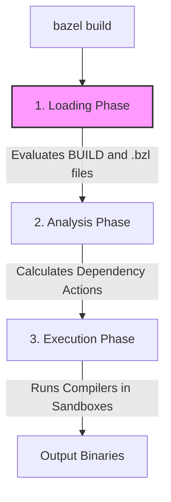

# Bazel Macros: Blueprints for Prefabricating Your Build Graph

Welcome! In this lecture, we're going to dive deep into **Bazel Macros** using the **Feynman Technique**: simple analogies, plain language, and direct examples based on our workspace.

If you have already worked through the [build_file_lecture.md](build_file_lecture.md) and [query_lecture.md](query_lecture.md), you know that BUILD files define the targets (libraries, binaries, tests) of your system. But as your project grows, declaring these targets over and over can become repetitive. 

This is where **Macros** come to the rescue!

---

## 🗺️ The Analogy: Prefabricated Building Modules

Let's return to our analogy of a Bazel project as a **modern city**:
*   **Targets** (`cc_library`, `cc_test`) are the individual structures (foundations, plumbing, inspector checks) built on a block.
*   Normally, for every single house you construct, you have to write a detailed blueprint for:
    1.  The structure itself (`cc_library`).
    2.  The safety inspector check (`cc_test`) to verify the structure.
*   If you are building a neighborhood with 100 identical houses, writing those two blueprint blocks 100 times in your package files is exhausting. You are copy-pasting the same boilerplates, changing only the name and the address.
*   A **Macro** is like ordering a **prefabricated housing package** from a factory. You call the factory and say: *"Send me a house module called 'UnitA', using concrete mix 'walls.cc' and safety parameters 'test.cc'."*
*   Behind the scenes, the factory (the `.bzl` file) expands the order and automatically lays down both the foundation target (`cc_library`) and the inspection target (`cc_test`) on your block. 
*   To the city planners (the Bazel compilation engine), it looks exactly like two separate targets. But to you (the developer), it's just a single, clean order line in your BUILD file.

---

## 📦 Phase 1: What is a Bazel Macro?

In Bazel, a **macro** is simply a Starlark (Python-like) function that instantiates one or more rules. 

> [!IMPORTANT]
> **Macros do not compile code.** 
> A macro is just a code generator for BUILD files. It writes BUILD code on your behalf before Bazel begins the heavy lifting of compilation.

### The Loading Phase vs. The Execution Phase
To understand macros, you must understand the lifetime of a Bazel invocation:



1.  **Loading Phase:** Bazel reads your `WORKSPACE` (and `WORKSPACE.bazel`), loaded `.bzl` files, and `BUILD` files. It evaluates the Starlark code. **Macros run entirely in this phase.** They execute their logic and instantiate rules.
2.  **Analysis Phase:** Bazel inspects the rule graph, evaluates configured attributes (`select()`), and decides *how* to build the targets.
3.  **Execution Phase:** Bazel runs the actual compiler commands (like `g++` or `python`) inside isolated sandboxes to generate files.

Because macros run in the **Loading Phase**, they have strict limitations:
*   ❌ They **cannot** read files on your hard drive programmatically.
*   ❌ They **cannot** run shell commands or compiler tools.
*   ✔️ They **can** run loops, string splits, dictionary lookups, and call other rules.

---

## 🔀 Phase 2: Macros vs. Custom Rules (The Crucial Difference)

Beginners often confuse **Macros** and **Custom Rules**. They are entirely different tools.

### Feature Comparison

| Feature | Starlark Macro | Custom Rule |
| :--- | :--- | :--- |
| **What it is** | A Starlark function that calls other rules. | A custom build schema defining a new target type. |
| **Execution Phase** | **Loading Phase** (BUILD parsing). | **Analysis Phase** (Command/Action graph creation). |
| **Complexity** | **Low.** If you can write a Python function, you can write a macro. | **High.** Requires understanding providers, contexts, actions, and inputs/outputs. |
| **Inputs** | Simple arguments (strings, lists, dicts). | Source files, configuration transitions, toolchains. |
| **Outputs** | Zero or more instantiated rules. | Files generated via actions (`ctx.actions.run()`). |
| **Common Use Case** | Reducing BUILD boilerplate; packaging standard configs. | Adding support for a new language or compiler. |

### Pros, Cons, and Decision Matrix

| Dimension | Starlark Macros | Custom Rules |
| :--- | :--- | :--- |
| **Pros** | <ul><li>**Easy to Write:** Standard Python/Starlark syntax with minimal learning curve.</li><li>**No Action Boilerplate:** No need to handle compilers, inputs/outputs, or caching manually.</li><li>**Batch Generation:** Can define multiple targets at once (e.g., library, test, and binary).</li></ul> | <ul><li>**Fully Configurable:** Complete control over compilation files, compilers, and execution commands.</li><li>**Access to `ctx`:** Full access to target configuration, toolchains, and environment.</li><li>**Optimally Cached:** Actions are tracked individually by Bazel, maximizing caching efficiency.</li></ul> |
| **Cons** | <ul><li>**No Build Action Access:** Cannot run compilers, copy files, or register shell commands directly.</li><li>**No Access to `ctx`:** Cannot access configuration flags or compiler toolchains.</li><li>**Namespace Constraints:** Must manage target names carefully using string suffixing to avoid collision.</li></ul> | <ul><li>**High Complexity:** Requires understanding rules, providers, runfiles, and action declarations.</li><li>**Boilerplate Heavy:** Even simple rules require defining attributes, input types, outputs, and returning providers.</li></ul> |
| **When to Use** | <ul><li>Reducing repetitive code in BUILD files (DRY principle).</li><li>Packaging targets that always belong together (e.g., standardizing a library alongside its unit test).</li><li>Pre-configuring standard targets with corporate flags or tags.</li></ul> | <ul><li>Adding support for a new language (e.g., Rust, Kotlin) or custom compilers.</li><li>Running static analyzers, linters, or custom code generators (like Protocol Buffers or code template engines).</li><li>Parsing custom file formats into standard files or executable binaries.</li></ul> |
| **How to Use** | Write standard Starlark functions calling rules (e.g., `cc_library(...)`) and export them in a `.bzl` file. | Write an implementation function registering actions on `ctx`, declare the target schema using `rule(...)`, and export it in a `.bzl` file. |

> [!WARNING]
> **No Context Object (`ctx`) in Macros!**
> A very common misconception is that macros have access to a context object (`ctx`). They **do not**. 
> The `ctx` object is exclusively passed to the implementation function of a **Custom Rule** during the Analysis Phase. Because macros run in the Loading Phase (before targets are analyzed), Bazel does not provide a build context or allow registering compilation actions inside macros.

---

## 🛠️ Phase 3: What is a Custom Rule?

While a **Macro** merely packages existing rules into a reusable template, a **Custom Rule** allows you to define a completely new type of target that Bazel doesn't natively support (like a tool to compile a new programming language or generate specialized assets).

### The Implementation Manual
A custom rule consists of:
1. **The Declaration (`rule()`)**: Defines the configuration attributes (e.g. `srcs`, `deps`) the rule expects.
2. **The Implementation Function (`ctx`)**: Runs during the **Analysis Phase** and receives the context object (`ctx`). Inside it, you declare output files using `ctx.actions.declare_file()` and register build execution recipes using `ctx.actions.run()` or `ctx.actions.run_shell()`.

#### Reference: All `ctx` Attributes and Methods

The `ctx` (context) object has the following attributes and methods:

| Attribute / Method | Type | Description |
| :--- | :--- | :--- |
| `ctx.actions` | `actions` | Exposes methods to declare files and register build actions (`run`, `run_shell`, `write`, `symlink`, etc.). |
| `ctx.attr` | `struct` | Accesses the values of target attributes defined in the rule schema (e.g., `ctx.attr.srcs`). |
| `ctx.bin_dir` | `directory` | The root directory where binary output artifacts are placed. |
| `ctx.configuration` | `configuration` | Represents the build configuration (e.g., compiler options, optimization mode). |
| `ctx.disabled_features` | `list of strings` | Features explicitly disabled for this target. |
| `ctx.executable` | `struct` | Accesses executable files declared in executable-type attributes (e.g., `ctx.executable.tool`). |
| `ctx.expand_make_variables(...)` | `method` | Resolves Make variables inside attribute strings (e.g., `$(location ...)`). |
| `ctx.features` | `list of strings` | Features enabled for this target. |
| `ctx.file` | `struct` | Accesses single-file attributes (e.g., `ctx.file.src` if `allow_single_file = True`). |
| `ctx.files` | `struct` | Accesses lists of files in multi-file attributes (e.g., `ctx.files.srcs`). |
| `ctx.fragments` | `fragments` | Accesses configuration fragments (like `ctx.fragments.cpp` or `ctx.fragments.jvm`). |
| `ctx.genfiles_dir` | `directory` | The root directory where generated source files are placed. |
| `ctx.info_file` | `File` | Text file containing workspace status details (like Git commit hash). |
| `ctx.label` | `Label` | The label of the current target (contains `.name`, `.package`, `.workspace_name`). |
| `ctx.outputs` | `struct` | Accesses pre-declared outputs of attributes. |
| `ctx.resolve_command(...)` | `method` | Resolves compiler/tool paths and environments for command execution. |
| `ctx.runfiles(...)` | `method` | Generates a runfiles object to package runtime assets alongside binaries. |
| `ctx.split_attr` | `struct` | Accesses attributes split by configuration transitions. |
| `ctx.target_platform` | `PlatformInfo` | Information about the targeted execution/build platform. |
| `ctx.toolchains` | `toolchains` | Accesses toolchains configured and registered for this rule. |
| `ctx.var` | `dict` | Dictionary containing all available Make variables. |
| `ctx.version_file` | `File` | Text file containing version information for the build. |

3. **Providers**: Output structures returned by the implementation function that expose files to dependent targets.

For example, here is a custom rule that counts the lines of a file:
```python
def _count_lines_impl(ctx):
    output_file = ctx.actions.declare_file(ctx.label.name + "_count.txt")
    ctx.actions.run_shell(
        inputs = [ctx.file.src],
        outputs = [output_file],
        command = "wc -l < {} > {}".format(ctx.file.src.path, output_file.path),
    )
    return [DefaultInfo(files = depset([output_file]))]

count_lines = rule(
    implementation = _count_lines_impl,
    attrs = {
        "src": attr.label(allow_single_file = True, mandatory = True),
    },
)
```

You would use it in a BUILD file just like any built-in rule:
```python
load("//build_tools:rules.bzl", "count_lines")

count_lines(
    name = "readme_lines",
    src = "README.md",
)
```

---

## 🔩 Phase 4: Anatomy of a Macro

All macros are written in Starlark files (ending with `.bzl`) and loaded into BUILD files.

Let's look at the basic template of a macro:

```python
# build_tools/my_macro.bzl
load("@rules_cc//cc:defs.bzl", "cc_library")

def my_macro(name, srcs, visibility = None, **kwargs):
    # 1. We can perform Starlark computations
    private_srcs = [s for s in srcs if not s.endswith(".h")]
    
    # 2. We call underlying rules to instantiate them
    cc_library(
        name = name,
        srcs = private_srcs,
        visibility = visibility,
        **kwargs # Forward remaining attributes
    )
```

### The Magic of `**kwargs`
The `**kwargs` argument (short for "keyword arguments") is a Starlark dictionary containing any extra attributes passed to the macro that weren't explicitly matched in the function signature (e.g. `copts`, `linkopts`, `tags`, `deprecation`). 

By forwarding `**kwargs` to the underlying rules, we make our macro compatible with standard Bazel features without having to write them all in our function declaration.

---

## 🏗️ Phase 5: Our First Macro (`cc_library_with_test`)

We have created a macro file at [build_tools/macros.bzl](build_tools/macros.bzl). Let's view the implementation:

```python
load("@rules_cc//cc:defs.bzl", "cc_library", "cc_test")

def cc_library_with_test(name, srcs, hdrs = None, deps = None, test_srcs = None, test_deps = None, **kwargs):
    # Resolve optional arguments to empty lists
    hdrs = hdrs or []
    deps = deps or []
    test_srcs = test_srcs or []
    test_deps = test_deps or []

    # 1. Define the library target
    cc_library(
        name = name,
        srcs = srcs,
        hdrs = hdrs,
        deps = deps,
        **kwargs
    )

    # 2. Define the test target (if test sources are specified)
    if test_srcs:
        cc_test(
            name = name + "_test",
            srcs = test_srcs,
            # The test automatically depends on the library we just built + test_deps
            deps = deps + test_deps + [":" + name],
            **kwargs
        )
```

> [!TIP]
> **Why use `None` instead of `[]` as defaults?**
> In standard Python, using mutable lists like `deps = []` as defaults is a classic anti-pattern because the default list object is evaluated once during definition time and shared across all calls. 
> In Starlark, default parameter values are **frozen** (made immutable) once the `.bzl` file loads, so you cannot mutate them at runtime (doing so throws a `cannot mutate frozen list` error). However, it is still the recommended Bazel style to use `None` and resolve it to a list dynamically (e.g. `deps = deps or []`). This keeps the code familiar to Python developers and allows you to easily differentiate between "unset" and "explicitly set to empty".

### Let's analyze how this works:
1.  It instantiates a standard `cc_library` named after the `name` argument.
2.  If `test_srcs` is provided, it instantiates a `cc_test` target automatically named `name + "_test"`.
3.  The test automatically includes the library (`":" + name`) in its dependencies (`deps`), meaning the developer doesn't have to manually link them!
4.  All extra arguments like `visibility` or `tags` are forwarded using `**kwargs`.

---

## 🔎 Phase 6: Loading and Instantiating the Macro

To use a macro, you must **load** it at the top of your `BUILD` file. 

Here is how you would use it:

```python
# utils/BUILD.bazel
load("//build_tools:macros.bzl", "cc_library_with_test")

cc_library_with_test(
    name = "math_lib",
    srcs = ["math.cc"],
    hdrs = ["math.h"],
    test_srcs = ["math_test.cc"],
    test_deps = ["@com_google_googletest//:gtest_main"],
)
```

This single declaration generates **two** targets behind the scenes:
1.  `//utils:math_lib`
2.  `//utils:math_lib_test`

---

## 🕵️ Phase 7: Under the Hood (Inspecting Macro Expansion)

How do you verify if your macro is working correctly without compiling the code? 
You can use `bazel query` with the `--output=build` flag to inspect what Bazel actually sees in its memory after the Loading Phase!

### Run it yourself:
1.  Open [utils/BUILD.bazel](utils/BUILD.bazel) and add a test-enabled library declaration.
2.  Run the query command in your terminal:
    ```bash
    bazel query //utils:math_lib_test --output=build
    ```
3.  Bazel will return the expanded target definition, showing exactly how the macro populated the files, attributes, and dependencies:
    ```python
    # Expanded output shows:
    cc_test(
      name = "math_lib_test",
      generator_name = "math_lib",
      generator_function = "cc_library_with_test",
      generator_location = "utils/BUILD.bazel:8",
      srcs = ["math_test.cc"],
      deps = ["@com_google_googletest//:gtest_main", ":math_lib"],
    )
    ```

Notice the `generator_*` attributes added by Bazel. These track which macro was responsible for creating the target, which makes troubleshooting simple.

---

## ⚠️ Phase 8: Rules of Engagement & Macro Gotchas

Macros are powerful, but they have subtle traps. Keep these guidelines in mind:

### 1. Target Name Collision
Every target in a package must have a unique `name`. If your macro generates multiple targets, you must suffix them to avoid collision:
```python
# ❌ INCORRECT: Both targets will attempt to occupy the name "my_target"
def bad_macro(name):
    cc_library(name = name)
    cc_test(name = name) # CRASH!

# ✔️ CORRECT: Suffixing ensures distinct namespace paths
def good_macro(name):
    cc_library(name = name)
    cc_test(name = name + "_test")
```

### 2. Loading Native Rules inside `.bzl` Files
Inside `.bzl` files, built-in rules (like `cc_library`, `genrule`, `filegroup`) are not automatically in the global namespace.
*   **Recommended approach:** Explicitly load them from their canonical rulesets:
    ```python
    load("@rules_cc//cc:defs.bzl", "cc_library")
    ```
*   **Alternative approach (Legacy/Built-in):** Use the `native` object prefix:
    ```python
    def my_macro(name):
        native.cc_library(name = name, ...)
    ```

### 3. Visibility and Packages
If you reference a local target inside a macro (e.g., `deps = [":" + name]`), this relative label operates inside the package of the **calling** BUILD file, not the `.bzl` file.
*   If `//utils/BUILD.bazel` calls `cc_library_with_test(name = "math")`, the label `":math"` correctly resolves to `//utils:math`.

---

## 🛠️ Phase 9: Hands-on Exercise

Let's test our understanding by writing and applying a macro in the repository.

### Step 1: Create a Library and a Test
Let's add a simple math library and a unit test under the `utils` package.

1.  Create [utils/math.h](utils/math.h):
    ```cpp
    #ifndef UTILS_MATH_H_
    #define UTILS_MATH_H_

    int add(int a, int b);

    #endif // UTILS_MATH_H_
    ```
2.  Create [utils/math.cc](utils/math.cc):
    ```cpp
    #include "utils/math.h"

    int add(int a, int b) {
        return a + b;
    }
    ```
3.  Create [utils/math_test.cc](utils/math_test.cc):
    ```cpp
    #include "utils/math.h"
    #include <cassert>

    int main() {
        assert(add(2, 3) == 5);
        return 0;
    }
    ```

### Step 2: Use the Macro in the BUILD File
Open [utils/BUILD.bazel](utils/BUILD.bazel) and add the following block to load and instantiate our macro:

```python
load("//build_tools:macros.bzl", "cc_library_with_test")

cc_library_with_test(
    name = "math",
    srcs = ["math.cc"],
    hdrs = ["math.h"],
    test_srcs = ["math_test.cc"],
)
```

### Step 3: Run the Targets
Run the build and test targets in your terminal to see them compile and pass:

```bash
# Build the library target
bazel build //utils:math

# Run the test target generated by the macro
bazel test //utils:math_test
```

Verify that the output shows `//utils:math_test PASSED`!
