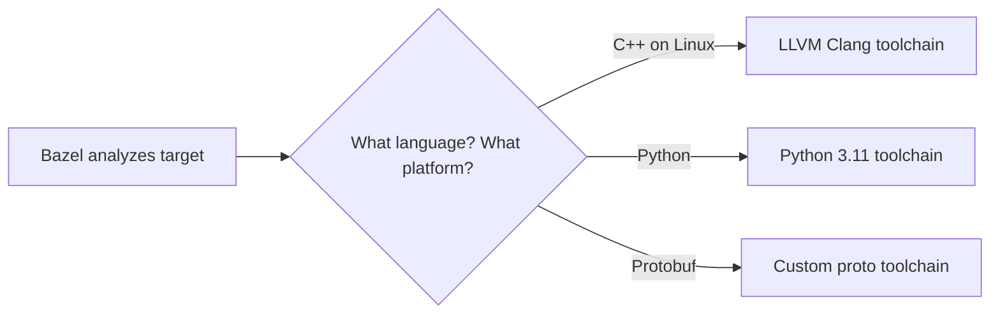

# WORKSPACE Masterclass: The Foundation of a Bazel Project

Welcome! In this lecture, we're going to thoroughly dissect the `WORKSPACE` file — one of the two main configuration files in Bazel (the other being `MODULE.bazel`). We'll explain every concept in plain language using the **Feynman Technique**: if we can't explain something simply, we don't understand it well enough.

Imagine your project as an **island**.
*   **WORKSPACE** is the **customs office** at the island's border. It decides: what from the outside world is allowed onto the island, where it came from, and what to call it.
*   **BUILD files** are the **internal city plan**: which buildings stand where, who depends on whom, who neighbors whom.

Without a `WORKSPACE`, Bazel doesn't know where your island ends — and therefore can't begin building anything.

---

## 🏷️ Phase 1: Birth of a Project — `workspace()`

Every Bazel project begins with a single declaration: **the workspace name**.

```python
workspace(
    name = "bazel_query_tutorial",
)
```

### What does this do?

This function tells Bazel: *"This is where my project starts. Its name is `bazel_query_tutorial`. Any file above this point is not mine."*

### Why a name?

The name becomes the **canonical address** of your project for the outside world:

| Situation | What the address looks like |
|:---|:---|
| Inside the project | `//core:memory` |
| From an external project | `@bazel_query_tutorial//core:memory` |
| Runfiles (at binary runtime) | `bazel_query_tutorial/core/memory.h` |

### Naming rules

| ✅ Allowed | ❌ Forbidden |
|:---|:---|
| `my_project` | `My Project` (spaces, uppercase) |
| `company-service` | `company.service` (dots are not recommended) |
| `lib_v2` | `@lib_v2` (the @ symbol is part of the syntax, not the name) |

### Key facts

*   `workspace()` MUST be the first call in the WORKSPACE file (before any `load()` or `http_archive()`).
*   If you don't create a WORKSPACE file at all, Bazel 7+ will still work — but it will look for `MODULE.bazel`. An empty WORKSPACE is needed for compatibility.
*   If `name` is omitted, Bazel assigns a name automatically (usually `__main__`). This is bad practice — always set the name explicitly.

---

## 🔧 Phase 2: Importing Tools — `load()`

Before doing anything, you need to "bring tools to the island." In Bazel, that mechanism is the `load()` function.

### The Analogy

Imagine you're building a house. `load()` is when you go to the hardware store and grab a specific toolset: *"I need a hammer (`http_archive`) and a tape measure (`http_file`) from the building materials section (`@bazel_tools`)."*

```python
# Load two functions from the built-in Bazel toolkit
load("@bazel_tools//tools/build_defs/repo:http.bzl", "http_archive", "http_file")
load("@bazel_tools//tools/build_defs/repo:git.bzl", "git_repository")
```

### Syntax

```
load("@repository//package:file.bzl", "function1", "function2")
```

| Component | Meaning | Analogy |
|:---|:---|:---|
| `@bazel_tools` | Built-in Bazel repository | The hardware store that comes bundled |
| `//tools/build_defs/repo` | Package inside that repository | A specific aisle in the store |
| `http.bzl` | Starlark file with definitions | A specific shelf with tools |
| `"http_archive"` | Function we import | The specific tool we pick up |

### Critical rules

1.  **`load()` — top level only.** You cannot place `load()` inside `if`, `for`, or functions.
2.  **Order matters.** You cannot `load()` from a repository that hasn't been declared above.
3.  **Built-in functions don't need `load()`.** These functions are available immediately:
    *   `workspace()`, `local_repository()`, `new_local_repository()`
    *   `bind()`, `register_toolchains()`, `register_execution_platforms()`

### What `load()` is NOT

`load()` is NOT a dependency! It doesn't load code into your binary. It merely makes Starlark functions available for use in the rest of the WORKSPACE file.

---

## 📦 Phase 3: The Workhorse — `http_archive()`

`http_archive()` does **90% of all the work** in a WORKSPACE file. It's responsible for one thing: *"Go to this URL, download the archive, verify it hasn't been tampered with, extract it, and make it a Bazel repository."*

### The Analogy

Think of Amazon delivery:
1.  📬 You order a package (**urls**).
2.  📦 It arrives in a box with a label (**strip_prefix** = the root folder name in the archive).
3.  🔒 You verify the serial number on the seal (**sha256**).
4.  📂 You unbox it and put it on the shelf under a name (**name**).

### Example 1: Library with its own BUILD file (GoogleTest)

```python
http_archive(
    name = "com_google_googletest",
    urls = [
        "https://github.com/google/googletest/archive/refs/tags/v1.14.0.tar.gz",
        "https://mirror.bazel.build/github.com/google/googletest/archive/refs/tags/v1.14.0.tar.gz",
    ],
    sha256 = "8ad598c73ad796e0d8280b082cebd82a630d73e73cd3c70057938a6501bba5d7",
    strip_prefix = "googletest-1.14.0",
)
```

**After this declaration**, a brand new "sub-island" appears in your project — `@com_google_googletest`. You can depend on it:

```python
# tests/BUILD.bazel
cc_test(
    name = "my_test",
    srcs = ["my_test.cc"],
    deps = ["@com_google_googletest//:gtest_main"],  # ← External dependency!
)
```

### Parameter breakdown

| Parameter | Type | Required? | What it does |
|:---|:---|:---|:---|
| `name` | string | ✅ Yes | Name of the new Bazel repository. Becomes `@name` in labels. |
| `urls` | list | ✅ Yes | List of download URLs. Bazel tries them in order. |
| `sha256` | string | 🔸 Strongly recommended | SHA-256 hash of the archive. Without it, the build is non-hermetic! |
| `strip_prefix` | string | No | Remove the root folder from the archive. |
| `build_file` | label | No | Path to a BUILD file, if the archive doesn't have one. |
| `build_file_content` | string | No | Inline BUILD file (alternative to `build_file`). |
| `patches` | list of labels | No | Patch files to apply after extraction. |
| `patch_args` | list | No | Arguments for `patch` (usually `["-p1"]`). |
| `patch_cmds` | list | No | Shell commands to execute after extraction. |
| `workspace_file` | label | No | Replace the extracted archive's WORKSPACE file. |
| `workspace_file_content` | string | No | Inline WORKSPACE file. |
| `type` | string | No | Archive type (`"tar.gz"`, `"zip"`, etc.). Usually auto-detected. |

### How to get the sha256?

```bash
# Method 1: via curl + shasum
curl -sL https://github.com/google/googletest/archive/refs/tags/v1.14.0.tar.gz | shasum -a 256

# Method 2: download and verify
wget https://github.com/google/googletest/archive/refs/tags/v1.14.0.tar.gz
sha256sum v1.14.0.tar.gz

# Method 3: Intentionally specify an empty sha256 = "" and run Bazel.
# Bazel will download the file and show the correct hash in the error message.
```

### Example 2: Library WITHOUT a BUILD file (zlib)

Many C/C++ libraries use CMake or Make and don't have BUILD files. You create a BUILD for them yourself:

```python
http_archive(
    name = "zlib",
    urls = ["https://github.com/madler/zlib/releases/download/v1.3.1/zlib-1.3.1.tar.gz"],
    sha256 = "9a93b2b7dfdac77ceba5a558a580e74667dd6fede4585b91eefb60f03b72df23",
    strip_prefix = "zlib-1.3.1",
    build_file_content = """
cc_library(
    name = "zlib",
    srcs = glob(["*.c"]),
    hdrs = glob(["*.h"]),
    copts = ["-Wno-implicit-function-declaration"],
    defines = ["HAVE_UNISTD_H"],
    includes = ["."],
    visibility = ["//visibility:public"],
)
""",
)
```

**`build_file_content` vs `build_file`:**

| Approach | When to use |
|:---|:---|
| `build_file_content = "..."` | Small, simple BUILD file (1-2 rules). |
| `build_file = "//third_party:zlib.BUILD"` | Complex BUILD file; stored as a separate file in your project. |

### Example 3: Patching external code

Sometimes an external library has a bug, and you don't want to fork it just for a single fix:

```python
http_archive(
    name = "some_buggy_lib",
    urls = ["https://example.com/lib-1.0.tar.gz"],
    sha256 = "abc123...",
    strip_prefix = "lib-1.0",
    # patches: applied in declaration order AFTER extraction.
    patches = [
        "//third_party/patches:fix_memory_leak.patch",
        "//third_party/patches:add_bazel_support.patch",
    ],
    # "-p1" — standard for patches generated via `git diff`
    patch_args = ["-p1"],
)
```

**Creating a patch file:**

```bash
# 1. Download and extract the library
# 2. Make a copy: cp -r lib-1.0 lib-1.0.orig
# 3. Make your changes in lib-1.0/
# 4. Create the patch:
diff -ruN lib-1.0.orig lib-1.0 > fix_memory_leak.patch
```

### Example 4: Shell commands instead of patches

For minor changes, `patch_cmds` is more convenient than `.patch` files:

```python
http_archive(
    name = "legacy_lib",
    urls = ["https://example.com/legacy-2.0.tar.gz"],
    sha256 = "def456...",
    strip_prefix = "legacy-2.0",
    patch_cmds = [
        # Create a BUILD if there isn't one
        "touch BUILD.bazel",
        # Remove conflict with other rules
        "rm -rf test/",
        # Fix an include path
        "sed -i 's|#include <old_path.h>|#include <new_path.h>|g' src/*.c",
    ],
)
```

> [!WARNING]
> `patch_cmds` makes the build less portable! Shell commands may behave differently on Linux and macOS (for example, `sed -i` has different syntax). For CI, always verify on the target platform.

---

## 🔗 Phase 4: Cloning from Git — `git_repository()`

An alternative to `http_archive` for projects hosted in Git repositories. Instead of downloading an archive, Bazel performs `git clone`.

### The Analogy

If `http_archive` is Amazon delivery (you receive a box), then `git_repository` is when you PERSONALLY drive to the store and pick up the item from the warehouse. Slower, but you get the full history.

```python
git_repository(
    name = "com_github_fmtlib_fmt",
    remote = "https://github.com/fmtlib/fmt.git",
    commit = "a0b8a92e3d1532361c2f7b18bd970898bea62bf0",
    shallow_since = "2024-01-04",
)
```

### Parameter breakdown

| Parameter | What it does | ⚠️ Notes |
|:---|:---|:---|
| `remote` | Git repository URL | Supports `https://` and `git@` (SSH) |
| `commit` | Full SHA-1 commit hash (40 characters) | **ALWAYS** use commit! |
| `tag` | Git tag (alternative to commit) | ❌ Dangerous! Tags can be moved (`git tag -f`) |
| `branch` | Git branch | ❌ Worst option! Result changes with every push |
| `shallow_since` | Date for shallow clone | Makes `git clone` much faster |
| `init_submodules` | `True`/`False` — whether to initialize git submodules | Default is `False` |

### `http_archive` vs `git_repository` — when to use which?

| Criterion | `http_archive` 🏆 | `git_repository` |
|:---|:---|:---|
| **Speed** | ✅ Faster (just download a file) | ❌ Slower (git clone + checkout) |
| **Hermeticity** | ✅ sha256 verification | 🔸 Relies on Git SHA |
| **CI reliability** | ✅ Works even if Git is unavailable | ❌ Requires Git on the build machine |
| **Private repos** | 🔸 Requires token in URL | ✅ Uses SSH keys |
| **Submodules** | ❌ Not supported | ✅ `init_submodules = True` |
| **Large repos** | ✅ Downloads only the needed version archive | ❌ May clone gigabytes |

> [!TIP]
> **Rule of thumb:** Use `http_archive` by default. Switch to `git_repository` only if you need submodules or SSH access to a private repository.

---

## 📂 Phase 5: Local Repositories

Not all dependencies live on the internet. Sometimes you need to connect a project that's sitting right next to you on disk.

### 5a: `local_repository()` — For another Bazel project

```python
local_repository(
    name = "my_other_project",
    path = "../my-other-bazel-project",
)
```

**Requirement:** The project at the given path MUST have a `WORKSPACE` or `MODULE.bazel`.

**Typical use cases:**
*   Monorepo with multiple Bazel projects in different folders.
*   Parallel development of two related libraries (instead of publishing + updating versions).
*   Temporarily connecting a local fork for debugging an issue.

### 5b: `new_local_repository()` — For non-Bazel code

```python
new_local_repository(
    name = "system_openssl",
    path = "/usr/local/opt/openssl",
    build_file_content = """
cc_library(
    name = "ssl",
    srcs = glob(["lib/*.dylib", "lib/*.so", "lib/*.a"]),
    hdrs = glob(["include/openssl/*.h"]),
    includes = ["include"],
    visibility = ["//visibility:public"],
)
""",
)
```

**Requirement:** The project must NOT have a WORKSPACE. You provide the BUILD file.

**Typical use cases:**
*   Connecting system libraries (`OpenSSL`, `zlib`, `CUDA`).
*   Wrapping legacy C/C++ code built by Makefile.
*   Testing integration with pre-compiled artifacts.

### The key difference

| | `local_repository` | `new_local_repository` |
|:---|:---|:---|
| **Project has WORKSPACE?** | ✅ Yes, required | ❌ No, we provide BUILD |
| **BUILD file** | Uses its own | You write your own |
| **Analogy** | Inviting a neighbor (they know their own address) | Accepting a delivery without a label (you attach the label) |

> [!CAUTION]
> **Hermeticity!** `local_repository` and `new_local_repository` are NOT hermetic! They depend on the filesystem state of a specific machine. If a colleague doesn't have `/usr/local/opt/openssl`, the build will fail. In CI, prefer `http_archive` or Docker containers with a fixed environment.

---

## 📥 Phase 6: Downloading Individual Files — `http_file()`

Sometimes you don't need an entire archive — just one specific file: an ML model, test data, a binary tool.

```python
load("@bazel_tools//tools/build_defs/repo:http.bzl", "http_file")

http_file(
    name = "test_dataset",
    urls = ["https://example.com/data/fixture.json"],
    sha256 = "abc123...",
    downloaded_file_path = "fixture.json",
)
```

**Usage in a BUILD file:**

```python
py_test(
    name = "model_test",
    srcs = ["model_test.py"],
    data = ["@test_dataset//file:fixture.json"],
)
```

### Parameters

| Parameter | What it does |
|:---|:---|
| `urls` | Download URL |
| `sha256` | Checksum |
| `downloaded_file_path` | Name of the saved file (default `"downloaded"`) |
| `executable` | `True` — make the file executable (for scripts/binaries) |

### Why `downloaded_file_path`?

By default, the file is saved as `downloaded`. This means you reference it as `@repo//file:downloaded` — not very intuitive. Setting `downloaded_file_path = "fixture.json"` gives you `@repo//file:fixture.json`.

---

## ⚙️ Phase 7: Toolchains and Platforms

### 7a: `register_toolchains()` — Registering build tools

**The Analogy:** A toolchain is a **set of tools on a workbench**. A painter has brushes, a plasterer has a trowel. Bazel looks at WHAT work needs to be done (programming language) and on WHICH platform (Linux, Mac, ARM), and automatically picks the right set.

```python
register_toolchains(
    "@llvm_toolchain//:cc-toolchain-x86_64-linux",
    "@rules_python//python:autodetecting_toolchain",
    "//toolchains:my_custom_proto_toolchain",
)
```

**How it works under the hood:**



**Registering means "making available."** Bazel itself decides which toolchain to use based on constraints (OS, CPU architecture, etc.).

### 7b: `register_execution_platforms()` — Where to run the build

```python
register_execution_platforms(
    "@local_config_platform//:host",      # Local machine
    "//platforms:remote_linux_x86_64",      # Remote server
)
```

| Term | Meaning | Example |
|:---|:---|:---|
| **Execution platform** | Where Bazel RUNS build actions | Your Mac, CI server, Remote Build Execution |
| **Target platform** | Where the built code will EXECUTE | Android phone, embedded IoT device |

---

## 🔀 Phase 8: An Artifact of the Past — `bind()` [DEPRECATED]

`bind()` is a mechanism for creating "aliases" in the special `//external` package.

```python
bind(
    name = "protobuf",
    actual = "@com_google_protobuf//:protobuf",
)

# Now instead of:
#   deps = ["@com_google_protobuf//:protobuf"]
# You can write:
#   deps = ["//external:protobuf"]
```

> [!WARNING]
> **`bind()` is officially deprecated!** Google discourages its use. Reasons:
> *   The link between `//external:name` and the actual target is not obvious.
> *   Doesn't work with `select()` (configurable attributes).
> *   Creates confusion in `bazel query`.
>
> **Instead of `bind()`, use:**
> *   `alias()` in BUILD files.
> *   `MODULE.bazel` with label_mapping (Bzlmod).

---

## 🧩 Phase 9: Transitive Dependency Hell

This is the **most important phase** for understanding WHY Bzlmod replaced WORKSPACE.

### The Problem

In WORKSPACE, every library must declare **ALL** of its dependencies. Bazel does NOT perform automatic transitive resolution.

### The Analogy

Imagine you're ordering a bookshelf from IKEA (http_archive). But IKEA says:
*   *"We don't put screws in the box. Here's the parts list — order them separately from ScrewMart."*
*   You order the screws. ScrewMart says: *"Did you already order the matching screwdriver? We don't work without it."*
*   ...and so on, recursively.

In WORKSPACE, you must write ALL of this manually:

```python
# Step 1: Main library
http_archive(name = "rules_proto", ...)

# Step 2: Its transitive dependencies (defined by rules_proto developers)
load("@rules_proto//proto:repositories.bzl", "rules_proto_dependencies", "rules_proto_toolchains")
rules_proto_dependencies()    # ← This macro declares ANOTHER 5-10 http_archive calls
rules_proto_toolchains()      # ← And registers toolchains

# Step 3: If rules_proto_dependencies() depends on something else...
# ...you'll need to add that too!
```

### The "Diamond Dependency" Problem

```
    Your project
      /     \
     A       B
      \     /
       C ???
```

If **A** depends on `C@1.0`, and **B** depends on `C@2.0`, in WORKSPACE **the one declared first wins**:

```python
# WORKSPACE
http_archive(name = "C", urls = ["...C-1.0.tar.gz"], ...)  # ← WINS!
http_archive(name = "C", urls = ["...C-2.0.tar.gz"], ...)  # ← Silently IGNORED!
```

Bazel won't even WARN you! The second declaration simply vanishes. This can lead to very subtle compilation errors or runtime crashes.

### How Bzlmod (MODULE.bazel) solves this

| Aspect | WORKSPACE | MODULE.bazel (Bzlmod) |
|:---|:---|:---|
| Transitive dependencies | ❌ Manual, recursive | ✅ Automatic via BCR |
| Diamond dependencies | ❌ "First one wins" | ✅ MVS (Minimal Version Selection) |
| Versioning | ❌ None (only hashes/commits) | ✅ Semantic versioning |
| Reproducibility | 🔸 Via sha256, but fragile | ✅ lockfile (MODULE.bazel.lock) |

---

## 🏗️ Phase 10: Custom Repository Rules

For complex scenarios (auto-detecting system libraries, generating code at initialization time), you can create **custom repository rules** in Starlark.

### The Analogy

`http_archive` is "buying a prefab house." A repository rule is "hiring an architect who designs a custom house to your specs."

### Example: Auto-detecting OpenSSL

```python
# build_tools/detect_ssl.bzl

def _detect_ssl_impl(ctx):
    """Repository rule that automatically finds OpenSSL on the system."""
    
    # ctx.execute() — runs a shell command on the host machine
    result = ctx.execute(["pkg-config", "--cflags", "--libs", "openssl"])
    
    if result.return_code != 0:
        fail("OpenSSL not found! Install: apt install libssl-dev")
    
    # ctx.file() — creates a file in the new repository
    ctx.file("BUILD.bazel", content = """
cc_library(
    name = "ssl",
    linkopts = ["{libs}"],
    visibility = ["//visibility:public"],
)
""".format(libs = result.stdout.strip()))

    # ctx.file() for WORKSPACE — required!
    ctx.file("WORKSPACE", "")

detect_ssl = repository_rule(
    implementation = _detect_ssl_impl,
    # environ: list of environment variables that affect the result.
    # If any of them changes — Bazel re-executes the rule.
    environ = ["OPENSSL_ROOT_DIR", "PKG_CONFIG_PATH"],
    # local: True = don't cache between runs (check every time)
    local = True,
)
```

**Usage in WORKSPACE:**

```python
load("//build_tools:detect_ssl.bzl", "detect_ssl")
detect_ssl(name = "system_ssl")
```

### Repository context API (`ctx`)

| Method | What it does |
|:---|:---|
| `ctx.file(path, content)` | Create a file in the repository |
| `ctx.execute(cmd)` | Execute a shell command |
| `ctx.download(url, output, sha256)` | Download a file |
| `ctx.download_and_extract(url, output, sha256)` | Download and extract an archive |
| `ctx.path(label_or_path)` | Get a path to a file |
| `ctx.os.name` | OS name (`"linux"`, `"mac os x"`, etc.) |
| `ctx.os.environ` | Dictionary of environment variables |
| `ctx.attr.name` | Access to rule attributes |
| `ctx.template(path, template, substitutions)` | Create a file from a template |
| `ctx.symlink(from, to)` | Create a symbolic link |
| `ctx.which(program)` | Find a program in `$PATH` |

---

## 📋 Phase 11: WORKSPACE Order and Structure

The WORKSPACE file is read by Bazel **strictly sequentially, top to bottom**. This means the order of lines is critical.

### The correct structure

```python
# ═══════════════════════════════════════════════
# 1. WORKSPACE DECLARATION
# ═══════════════════════════════════════════════
workspace(name = "my_project")

# ═══════════════════════════════════════════════
# 2. IMPORT BUILT-IN FUNCTIONS
# ═══════════════════════════════════════════════
load("@bazel_tools//tools/build_defs/repo:http.bzl", "http_archive")

# ═══════════════════════════════════════════════
# 3. FOUNDATIONAL DEPENDENCIES (that others depend on)
# ═══════════════════════════════════════════════
http_archive(name = "bazel_skylib", ...)
http_archive(name = "platforms", ...)

# ═══════════════════════════════════════════════
# 4. LANGUAGE RULES (rules_cc, rules_python, rules_go...)
# ═══════════════════════════════════════════════
http_archive(name = "rules_cc", ...)
http_archive(name = "rules_python", ...)

# Load and call *_deps() from the new rules
load("@rules_python//python:repositories.bzl", "py_repositories")
py_repositories()

# ═══════════════════════════════════════════════
# 5. PROJECT LIBRARIES
# ═══════════════════════════════════════════════
http_archive(name = "com_google_googletest", ...)
http_archive(name = "com_google_absl", ...)

# ═══════════════════════════════════════════════
# 6. TOOLCHAINS AND PLATFORMS
# ═══════════════════════════════════════════════
register_toolchains("//toolchains:my_toolchain")
register_execution_platforms("//platforms:my_platform")
```

> [!IMPORTANT]
> **The Golden Rule of WORKSPACE:** You cannot use `load()` from a repository that hasn't been declared above. This means `load("@rules_python//...", ...)` can ONLY appear AFTER `http_archive(name = "rules_python", ...)`.

---

## ⚖️ Phase 12: WORKSPACE vs MODULE.bazel — The Full Comparison

Starting with Bazel 7, Google recommends using `MODULE.bazel` (Bzlmod) instead of `WORKSPACE`. Here's a detailed comparison:

### Same task — two approaches

**Task:** Add GoogleTest to the project.

**WORKSPACE approach:**

```python
load("@bazel_tools//tools/build_defs/repo:http.bzl", "http_archive")

http_archive(
    name = "com_google_googletest",
    urls = ["https://github.com/google/googletest/archive/refs/tags/v1.14.0.tar.gz"],
    sha256 = "8ad598c73ad796e0d8280b082cebd82a630d73e73cd3c70057938a6501bba5d7",
    strip_prefix = "googletest-1.14.0",
)
```

**MODULE.bazel approach (Bzlmod):**

```python
bazel_dep(name = "googletest", version = "1.14.0")
```

**One line vs five!** Bzlmod automatically finds the archive in the BCR (Bazel Central Registry), verifies the hash, and fetches ALL transitive dependencies.

### Full comparison table

| Aspect | WORKSPACE | MODULE.bazel (Bzlmod) |
|:---|:---|:---|
| **Minimal example** | 5+ lines | 1 line |
| **Transitive deps** | Manual, recursive | Automatic |
| **Version resolution** | "First one wins" | MVS (Minimal Version Selection) |
| **Lockfile** | ❌ None | ✅ `MODULE.bazel.lock` |
| **Central registry** | ❌ None | ✅ BCR (registry.bazel.build) |
| **Custom repo rules** | `load()` + call in WORKSPACE | Module extensions |
| **Order matters?** | ✅ Yes, strictly sequential | ❌ No, declarative |
| **Patch support** | ✅ `patches`, `patch_cmds` | ✅ `patches` in `archive_override()` |
| **Status** | 🔸 Legacy (still supported) | ✅ Recommended |

### When do you still need WORKSPACE?

1.  **Legacy projects** — massive codebases that are difficult to migrate.
2.  **Dependencies without Bzlmod support** — libraries not yet in the BCR.
3.  **Transition period** — Bazel 7 supports both formats simultaneously (WORKSPACE + MODULE.bazel).
4.  **Learning** — WORKSPACE gives deeper insight into Bazel's internal mechanics.

> [!NOTE]
> **In our tutorial project**, we use both files simultaneously. `MODULE.bazel` manages `rules_python` and `rules_cc` via Bzlmod, while `WORKSPACE` demonstrates legacy approaches. Bazel 7 processes both files, with **Bzlmod taking priority** on name conflicts.

---

## 🐛 Phase 13: Common Errors and Debugging WORKSPACE

### Error 1: "No repository visible as '@my_dep'"

```
ERROR: no such package '@@my_dep//': The repository '@@my_dep' could not be resolved
```

**Cause:** You're using `@my_dep` in a BUILD file but forgot to declare `http_archive(name = "my_dep", ...)` in WORKSPACE.

**Fix:** Add the corresponding `http_archive()` or `bazel_dep()`.

### Error 2: "Checksum mismatch"

```
Error downloading [...]: Checksum was abc123... but wanted def456...
```

**Cause:** The URL now points to a DIFFERENT file (the library was updated, or someone substituted the archive).

**Fix:** Update the `sha256` or `urls` to the correct version.

### Error 3: "load() cannot find .bzl file"

```
ERROR: error loading package '': [...] bzl file doesn't exist
```

**Cause:** You're trying to `load()` from a repository that hasn't been declared above.

**Fix:** Move the `http_archive()` for that repository ABOVE the `load()` line.

### Error 4: Build works locally but not in CI

**Cause:** `new_local_repository()` with a path that only exists on your machine.

**Fix:** Replace `new_local_repository()` with `http_archive()`, or use a Docker container with a fixed environment in CI.

### Debugging commands

```bash
# Show ALL external repositories that WORKSPACE declares
bazel query '//external:*'

# Show where a specific external repository is physically located
bazel info output_base
# → External repositories: $(bazel info output_base)/external/<name>

# Verify that an archive was extracted correctly
ls -la $(bazel info output_base)/external/com_google_googletest/

# Reload ALL external dependencies (clear cache)
bazel clean --expunge
bazel fetch //...
```

---

# 📚 Comprehensive Cheatsheet: WORKSPACE Functions

### Declaration and naming

| Function | What it does | When to use |
|:---|:---|:---|
| `workspace(name)` | Declares the workspace name | Always the first line |
| `load(label, *symbols)` | Imports Starlark functions | Before using any external function |

### Loading external dependencies

| Function | What it does | When to use |
|:---|:---|:---|
| `http_archive(name, urls, sha256, ...)` | Downloads and extracts an archive from the internet | **90% of cases.** The primary way to add dependencies |
| `http_file(name, urls, sha256, ...)` | Downloads a single file | ML models, test data, binaries |
| `git_repository(name, remote, commit, ...)` | Clones a Git repository | Private repos with SSH, repos with submodules |
| `local_repository(name, path)` | Connects a local Bazel project | Parallel development of related projects |
| `new_local_repository(name, path, build_file)` | Connects a local non-Bazel project | System libraries, legacy code |

### Toolchain and platform configuration

| Function | What it does | When to use |
|:---|:---|:---|
| `register_toolchains(*labels)` | Registers toolchains for automatic selection | Cross-compilation, custom languages |
| `register_execution_platforms(*labels)` | Registers execution platforms | Remote Build Execution, specific CI runners |
| `bind(name, actual)` ⚠️ | Creates an alias in `//external` | **DEPRECATED.** Only for legacy compatibility |

### Custom repository rules (Starlark API)

| ctx Method | What it does |
|:---|:---|
| `ctx.file(path, content)` | Create a file in the repository |
| `ctx.execute(cmd_list)` | Execute a shell command |
| `ctx.download(url, output, sha256)` | Download a file |
| `ctx.download_and_extract(url, output, sha256, stripPrefix)` | Download and extract an archive |
| `ctx.path(label_or_string)` | Return a path |
| `ctx.template(path, template_path, substitutions)` | Generate a file from a template |
| `ctx.symlink(target, link_name)` | Create a symlink |
| `ctx.which(program)` | Find a program in $PATH |
| `ctx.os.name` | Return the OS name |
| `ctx.os.environ` | Dictionary of env variables |
| `ctx.attr.<name>` | Access to rule attributes |

---

# 🛠️ Comprehensive Cheatsheet: http_archive Parameters

| Parameter | Type | Default | Description |
|:---|:---|:---|:---|
| `name` | string | — | **Required.** Repository name (`@name//...`) |
| `urls` | list[string] | — | **Required.** Download URLs (fallback order) |
| `sha256` | string | `""` | SHA-256 hash of the archive (hermeticity!) |
| `strip_prefix` | string | `""` | Root directory to strip |
| `build_file` | label | `None` | Path to a BUILD file |
| `build_file_content` | string | `""` | Inline BUILD file |
| `patches` | list[label] | `[]` | Patch files to apply |
| `patch_args` | list[string] | `["-p0"]` | Arguments for `patch` |
| `patch_cmds` | list[string] | `[]` | Shell commands after extraction |
| `patch_cmds_win` | list[string] | `[]` | Shell commands for Windows |
| `workspace_file` | label | `None` | Replacement WORKSPACE file |
| `workspace_file_content` | string | `""` | Inline WORKSPACE file |
| `type` | string | `""` | Archive type (usually auto-detected) |
| `auth_patterns` | dict | `{}` | Authentication patterns for URLs |
| `integrity` | string | `""` | SRI hash (alternative to sha256) |
| `canonical_id` | string | `""` | ID for caching (for mirrors) |
| `repo_mapping` | dict | `{}` | Mapping of external repository names |

---

# 🔄 Comprehensive Cheatsheet: Migrating WORKSPACE → Bzlmod

| WORKSPACE construct | MODULE.bazel (Bzlmod) equivalent |
|:---|:---|
| `workspace(name = "x")` | `module(name = "x", version = "1.0")` |
| `http_archive(name = "lib", ...)` | `bazel_dep(name = "lib", version = "1.0")` |
| `load("@lib//:deps.bzl", "lib_deps"); lib_deps()` | Automatic via BCR |
| `git_repository(name = "lib", commit = "...")` | `git_override(module_name = "lib", commit = "...")` |
| `local_repository(name = "lib", path = "...")` | `local_path_override(module_name = "lib", path = "...")` |
| `http_archive(name = "lib", patches = [...])` | `archive_override(module_name = "lib", patches = [...])` |
| `bind(name = "alias", actual = "@lib//:target")` | Not needed (label_mapping) |
| `register_toolchains("@lib//:toolchain")` | `register_toolchains("@lib//:toolchain")` ← same |
| Custom `repository_rule` | Module extension (`module_extension()`) |

---

Congratulations! 🎉 You now understand WORKSPACE from foundation to rooftop. Even if you work exclusively with Bzlmod — knowledge of WORKSPACE helps you understand legacy code, debug dependency issues, and appreciate the elegance of the modern approach.

Next step: open the `MODULE.bazel` of our project and compare how much simpler it is than `WORKSPACE` for achieving the same goals!
